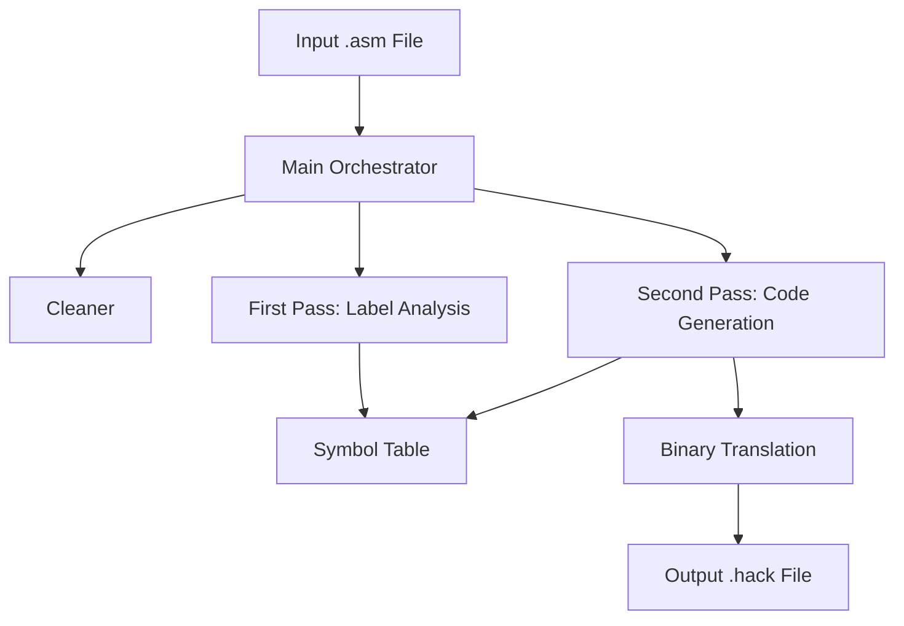

# Hack Assembler - Design Document

## Architecture Overview

The **Hack Assembler** is a two-pass assembler designed to translate symbolic assembly language (`.asm`) into binary machine code (`.hack`) for the Hack computer architecture.

### System Components

### Module Descriptions

1.  **Cleaner (`clean_line`)**:
    *   Removes whitespace and comments from the source code.
    *   Ensures that only relevant instructions are processed.

2.  **Symbol Table (`symbols`)**:
    *   A mapping of symbolic names to memory addresses.
    *   Preloaded with predefined symbols (e.g., `SP`, `SCREEN`, `R0-R15`).
    *   Dynamically updated during assembly for labels and variables.

3.  **First Pass (`first_pass`)**:
    *   Scans the cleaned source code for label definitions `(LABEL)`.
    *   Adds labels to the Symbol Table with their corresponding ROM address.

4.  **Second Pass (`assemble`)**:
    *   Translates **A-instructions** (`@value`) by resolving symbols or direct numeric values.
    *   Translates **C-instructions** (`dest=comp;jump`) by breaking them into mnemonics and looking up their binary equivalents in predefined tables.

5.  **Binary Translation (`to_binary`)**:
    *   Converts integer values into 16-bit binary strings.

## Data Structures

-   `dest_table`: Maps destination mnemonics to 3-bit binary strings.
-   `comp_table`: Maps computation mnemonics to 7-bit binary strings (including the `a` bit).
-   `jump_table`: Maps jump mnemonics to 3-bit binary strings.
-   `symbols`: Stores all predefined and user-defined symbols.

## Execution Flow

1.  **Initialization**: Preload symbols.
2.  **Reading**: Read the input `.asm` file.
3.  **Cleaning**: Strip comments and whitespace.
4.  **Pass 1**: Identify labels and update the symbol table.
5.  **Pass 2**: Iterate through instructions, translate to binary, and resolve variables.
6.  **Writing**: Save the resulting binary strings to a `.hack` file.
